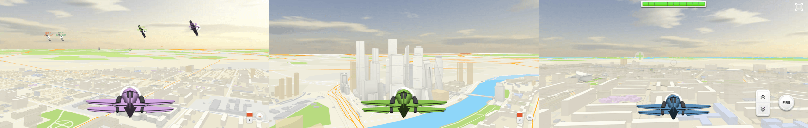
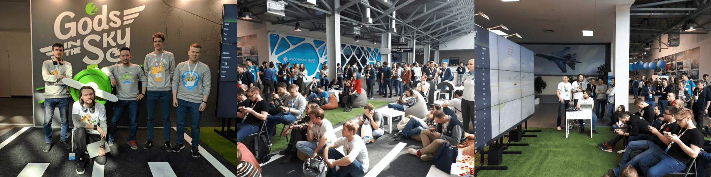

# airplanes-game

Multiplayer game with 3D flights of airplanes over the city map.



[Try a realtime multiplayer demo](https://airplanes.trufi.art/)

## Using

The game consists of three different projects:
1. **Main Server** is an authorization server that connects players with game servers. It must be only one.
2. **Game Server** is a server for one game room. Player game interactions happen through this server. Many game servers can connect to the main server.
3. **Client** is a client game application. In development, it's another server, on production – static files on the main server.

### Configuration

To set up the whole project, you need to configure their URLs with `.env` config.

For example:

```sh
# To change main server
MAIN_SERVER_URL=http://localhost:3002

# To change game server
GAME_SERVER_URL=localhost:3001
```

You can also change other optional settings:
```sh
# To change city for the game server.
# It can be: nsk, tomsk, omsk, kemerovo, barnaul, krasnoyarsk.
CITY=nsk  

# To start the game server as a tournament.
GAME_TYPE=tournament

# To change only ports
MAIN_SERVER_PORT=3002
GAME_SERVER_PORT=3001

# To change server for map tiles
TILE_SERVER_URL=trufi.art:8003
```

### Development

1. `npm install` 
2. `npm run server` – to start main authorization server on 3002 port
3. `npm run game` – to start game server on 3001 port
4. `npm run dev` – to start client dev-server on 3000 port
5. Open http://localhost:3000

### Production

1. `npm run build` – to build all projects
2. `npm run prod:main` – to start main authorization server
3. `npm run prod:game` – to start game server

### Client modes

The game client has two modes:
1. **Player** to play the game as a player.
2. **Observer** to observe the game as a spectator. To enter the mode, you need to add `?observer` parameter to the URL, e.g., http://localhost:3000?observer.

### Bots

To add bots flying around, you need:
1. Change the game `serverUrl` in `src/bot/index.ts` file
2. Start a bot script `npm run bots`

## Team

It was used in 2GIS stand at the CodeFest 2019 conference and developed by a small team of:

- [Mstislav Zhivodkov](https://github.com/Trufi)
- [Andrew Mikhailov](https://github.com/m7v)
- [Dmitriy Gordienko](https://github.com/ok-go)
- [Ivan Surin](https://github.com/surin1)

